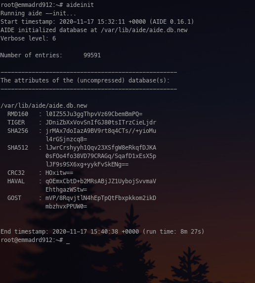
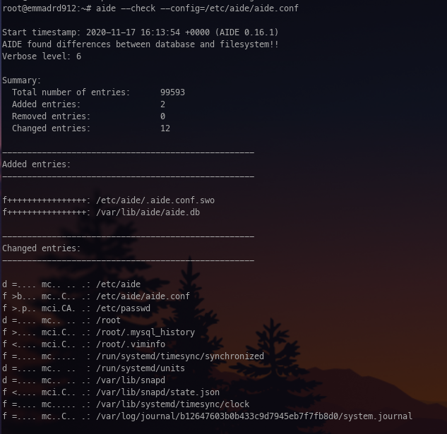
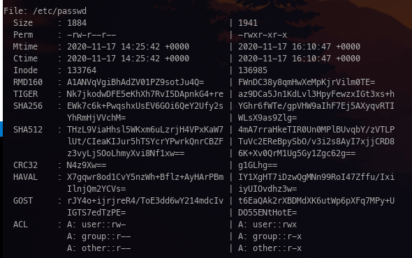
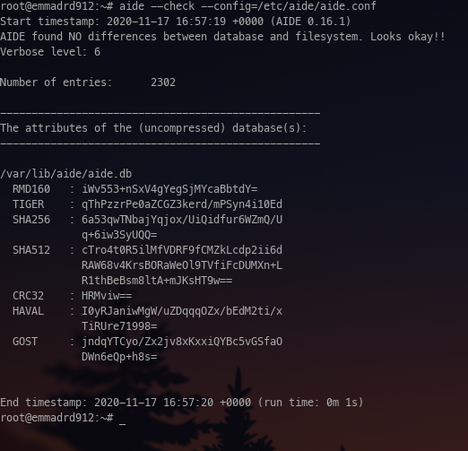
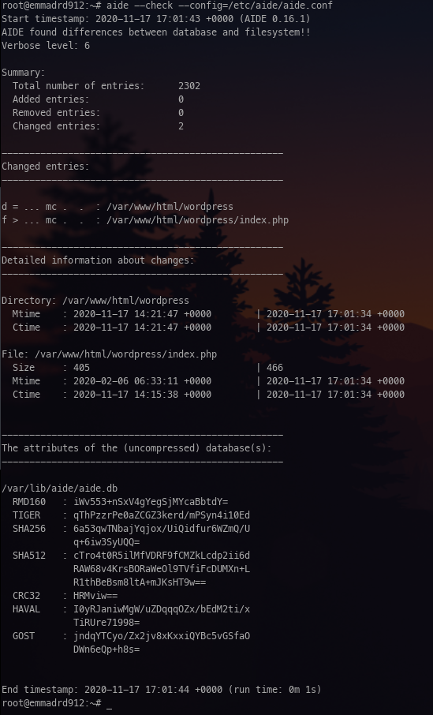
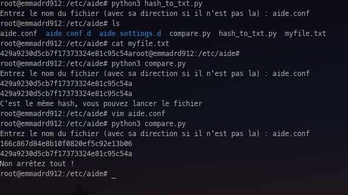

# TP1 : Le contrôle d'intégrité d'un système de fichiers
## Installation et configuration du HIDS sur un serveur web Linux Debian

## Classe : B3B
## Elèves : Emma Durand **[@emmadrd912](https://github.com/emmadrd912)** et Pierre Ceberio **[@PierreYnov](https://github.com/PierreYnov)**

# Sommaire

- [Le lab](#le-lab)
- [Découverte de l'outil](#d%C3%A9couverte-de-loutil)
    - [I. Rappels théorique sur la détection d'intrusion](#i-rappels-th%C3%A9orique-sur-la-d%C3%A9tection-dintrusion)
    - [II. Découverte de AIDE](#ii-d%C3%A9couverte-de-aide)
- [Configuration de l'outil](#configuration-de-loutil)
    - [I. Préparation du fichier de configuration](#i-pr%C3%A9paration-du-fichier-de-configuration)
    - [II. Personnalisation de la configuration](#ii-personnalisation-de-la-configuration)
- [Renforcement de la sécurité de l'HIDS](#renforcement-de-la-s%C3%A9curit%C3%A9-de-lhids--utilisation-de-la-cryptographie-pour-signer-la-base-de-donn%C3%A9es)
- [Automatisation des tâches](#automatisation-des-t%C3%A2ches)

## Le Lab

Machine ``Debian`` avec ``Apache`` et un blog ``Wordpress`` qui tourne.

## Découverte de l'outil

### I. Rappels théorique sur la détection d'intrusion

**- Qu'est-ce qu'un HIDS ?**

Traduction littérale : "Host-based intrusion detection system".

C'est un mécanisme qui permet de surveiller le système sur lequel il est installé, pour pouvoir détecter les intrusions. Il analyse les éléments internes d'un système informatique et vérifie que tout apparaît comme prévu, sans avoir été modifié par des intrus.

**- La différence avec un IDS classique ?**

Un IDS classique va être installé sur le réseau pour détecter les intrusions, là où un HIDS est directement basé sur le serveur/ordinateur.

**- Comment la " cryptographie " de ``Aide`` permet-elle de contrôler l'intégrité des fichiers ? Quels sont les algorithmes qui interviennent ?**

Aide créer une base de données à partir de règles d'expressions configurées dans un fichier. Une fois la base initialisée, il utilise un algorithme pour contrôler l'intégrité du fichier.
Les algorithmes qui interviennent sont : ``md5, sha256, rmd160, tiger, haval, gost, crc32`` etc ...

### II. Découverte de AIDE

**- Expliquez le fonctionnement de ``Aide``**

Aide un est outil de suivi des modifications au système de fichiers. Il crée une BDD à partir des regex voulus/choisis dans le fichier de conf. Cette BDD sert à vérifier l'intégrité des fichiers en s'appuyant sur différents algorithmes (listé au-dessus) de résumé de message.

## Configuration de l'outil

### I. Préparation du fichier de configuration

**- Expliquer les fichiers et attributs surveillés :**

De base, si on ne spécifie aucun répertoire, tous les fichiers du système seront monitorés.

Voici une liste ci-dessous des attributs qu'on peut surveiller sur les fichiers :

On passe à l'exécution de l'HIDS :

    - on doit générer notre première BDD
    - on doit forcer l'exécution du contrôle d'intégrité de ``Aide`` avec l'option ``-check`` (vérif que tout est OK)
    - récupérer le PID et stopper le processus

    - passage au test de cette nouvelle protection mise en place :

        - 1) Modifier un fichier qui est surveillé
        - 2) Reproduire la manipulation

**- Constater et expliquer en détail toutes les manipulations**

Pour générer notre première BDD on tape ``aideinit``

Puis dans /var/lib/aide on tape ``update-aide.conf``

Ensuite ``cp /var/lib/aide/aide.conf.autogenerated /etc/aide/aide.conf``

Puis on exécute le contrôle d'intégrité ``aide -c /etc/aide/aide.conf -C``

C'est normal qu'il n'y ait pas de différence, car nous n'avons rien modifié.

Pour récupérer le PID on tape ``ps -aux`` et on le stoppe en tapant ``kill -9 le_pid ``.

On va maintenant modifier un fichier, ici le ``/etc/passwd`` qui est sous surveillance, avec la modification de droit au fichier (``chmod 755 /etc/passwd``) et le rajout d'une ligne.

On revérifie alors une fois les modifications effectuées :

``aide --check --config=/etc/aide/aide.conf``

AIDE a bien detecté les changements ! On peut voir dans les entrées changées que notre fichier passwd est bien là !

### II. Personnalisation de la configuration

Passage à la surveillance du blog :

    - vérifier le bon fonctionnement du service

    - modifier la configuration de ``Aide`` pour " correspondre au nouveau besoin de sécurité "
        nouveau besoin = vérifier que les fichiers sources du blog ne sont pas modifiés, hormis ceux disponible en écriture pour une personne depuis internet

    - effectuer un nouveau test d'intégrité

**- Expliquer les modifications et les justifier**

On modifie le ``aide.conf``

    rule = p+n+u+g+s+m+c+xattrs

    /var/lib/www/wordpress rule

On va init avec la nouvelle conf ``aide -c /etc/aide/aide.conf -i``

On remplace la db :

``cp /var/lib/aide/aide.db{.new,}``

On check :

``aide --check --config=/etc/aide/aide.conf``

On modifie une ligne sur le fichier ``/var/lib/www/wordpress/index.php`` et on revérifie.

Les modifications sont bien détectées.

##  Renforcement de la sécurité de l'HIDS : utilisation de la cryptographie pour signer la base de données.

Il faut qu'on s'assure que la BDD de référence ne soit pas corrompue.

On va devoir signer cette BDD et le fichier de configuration grâce à ``Aide``. Puis forcer ``Aide`` à contrôler la signature de cette BDD avant chaque contrôle, et ainsi refuser les mauvaises signatures.

Mise en oeuvre :

    - générer une nouvelle BDD
    - signer la BDD et le fichier de configuration
    - configuration ``Aide`` pour qu'il vérifie les signatures

**- Expliquer les modifications et les justifier**

Vu que les fonctionnalités permettant de signer le fichier de configuration et la BDD ne sont plus sur notre version de AIDE. Nous allons développer un script Python qui fera ces vérifications par signature MD5 et nous dira si il y a eu des modifications ou non.

- ``hash_to_txt.py`` = on stocke le hash des fichiers originaux conf et bdd dans un fichier texte grâce à ce script Python3

- ``compare.py`` = il compare le fichier bdd actuel / le fichier de conf avec le hash enregistré dans le fichier texte, et dit si c'est le même ou si il y a eu altération

**- Quelle autre mesure indispensable peut-on prendre pour s'assurer que ce soit la bonne BDD ?**

Pour s'assurer que ce soit la bonne BDD, on peut placer le fichier originale de la BDD sur une **clé USB ou un stockage Cloud**, afin de pouvoir à tout moment le comparer manuellement avec la signature du fichier BDD sur le serveur.

Regarder l'**heure de dernière modification** du fichier BDD est aussi une mesure à prendre.

## Automatisation des tâches

- Création d'une tâche CRON qui exécute ``Aide`` avec un contrôle de la signature de base.

**- Expliquer les modifications**

**- Quels cas peuvent donner de faux positifs ?**

Un faux positif peut venir dans le cas d'un **update** de WordPress, qui modifiera plusieurs dizaines de fichiers (voire centaines) et modifiera totalement la BDD ou même tout simplement lorsque l'administrateur souhaitera **ajouter des modules** à son WP ou **modifier** du texte.

**- Rédigez une procédure permettant de prévenir ces FP :**

Il faut prévoir un **update de la BDD** originelle après chaque modification/update du WP. Et ainsi ne pas pouvoir avoir de FP.
